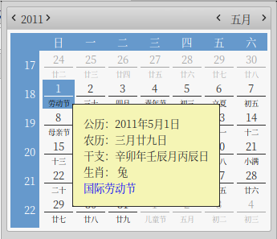

# 农历日历



# 编译安装

```
meson build -Dprefix=/usr
ninja -C build
sudo ninja -C build install
```

# 系统日历自动显示农历

仅限于 Gtk3 使用 GtkCalendar 的情况。

编译时启用gtk模块：

```
meson build -Dprefix=/usr -Denable_gtk_modules=true
ninja -C build
sudo ninja -C build install
```

在 /etc/X11/xinit/xinitrc.d/ 新建文件 70-lunar-calendar.sh，并增加可执行权限， 内容为：

```
export GTK3_MODULES=lunar-calendar-module
```
